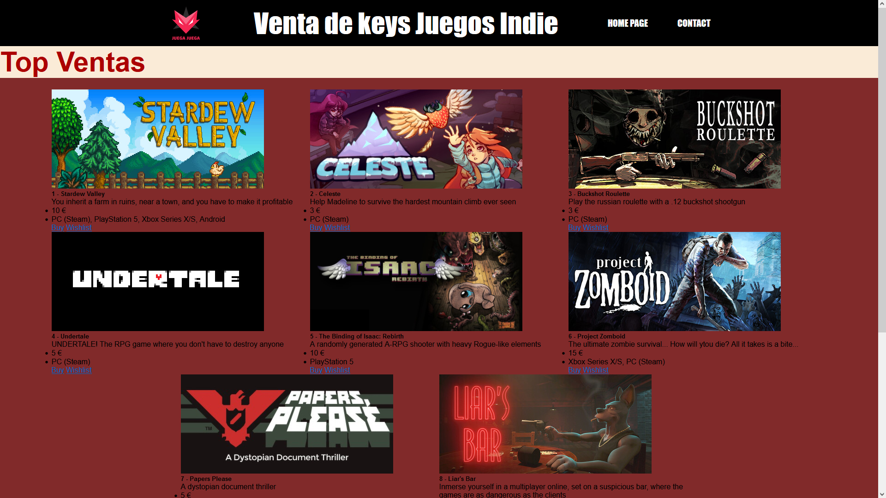

# ProjectGroup5

Es un proyecto de clase realizado sobre una empresa de venta de videojuegos indie en formato digital. 

## Descripción

Nuestro Proyect Game es una plataforma digital dedicada a la venta de videojuegos indie, diseñada para conectar a desarrolladores apasionados con jugadores que buscan experiencias únicas y originales. Nuestro objetivo es ofrecer un espacio donde la creatividad y la innovación en el desarrollo de videojuegos florezcan, proporcionando un escaparate para títulos que desafían las convenciones del mercado.

Trabajamos para poner en practica las funciones con el lenguaje JSON, javascript y css para impripir Cards en nuestro Html de forma limpia y ordenada.

## Demostracion

## Tecnologias

Usamos lenguajes de programacion:
- Html
- Css
- Javascript
- Json

## Herramientas 

Para realizar este proyecto trabajamos con herramientas:
- Visual Studio Code
- Git bash
- GitHub

    
## Licencia

[ProyectGroup5](https://github.com/Gabhyxx/ProjectGroup5.git)

## Autores

- [@alvaro](https://github.com/Kalixto73a)
- [@Jose Gabriel](https://github.com/Gabhyxx)
- [@Isac](https://github.com/ruzo0)
- [@Rene](https://github.com/mrene42)